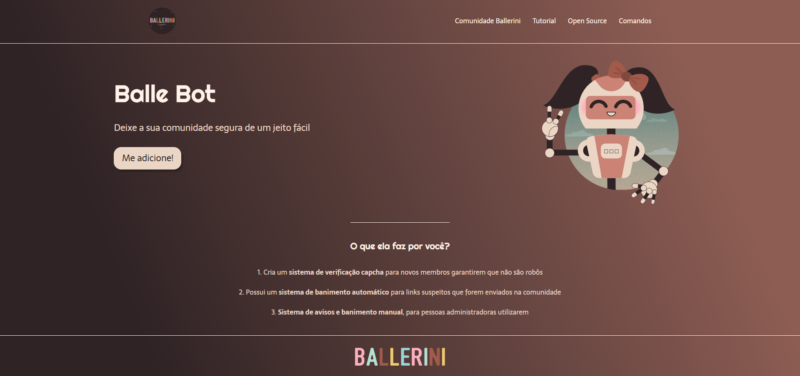

# Balle Bot Landing Page

Durante o TechGuide.sh da Alura, um projeto de landing page foi desenvolvido para um bot do Discord, utilizando HTML e CSS. O objetivo do projeto era criar uma página capaz de apresentar as funcionalidades do bot e incentivando os usuários a adicioná-lo em seus servidores.

## 🚀 Demonstração

[Clique aqui](https://flaviomattosdev.github.io/Tech-Guide-Alura-Balle-Bot/) para acessar o resultado final do projeto.

## 🛠️ Tecnologias Utilizadas

* [HTML](https://developer.mozilla.org/pt-BR/docs/Web/HTML) - Linguagem de Marcação
* [CSS](https://developer.mozilla.org/pt-BR/docs/Web/CSS) - Linguagem de Estilização

## 👨‍💻 Desenvolvedor

    
    
&nbsp&nbsp&nbspFlávio Mattos 
    &nbsp&nbsp&nbsp<a href="https://www.instagram.com/fflaviomattos/">Instagram</a>&nbsp;|&nbsp;<a href="https://github.com/FlavioMattosDev">GitHub</a>&nbsp;|&nbsp;<a href="https://www.linkedin.com/in/flavio-mattos/">LinkedIn</a>&nbsp;

  

---
